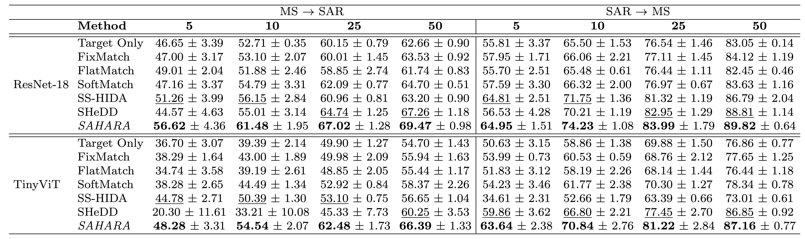
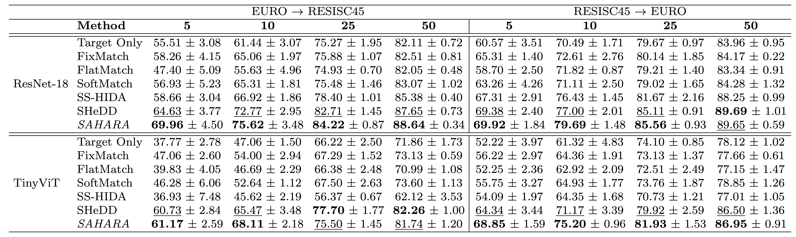

# SAHARA: Heterogeneous Semi-Supervised Transfer Learning with Adversarial Adaptation and Dynamic Pseudo-Labeling

## Framework overview 


**Considered setting:** Semi-supervised domain adaptation methods aim to generalize from a labeled source domain to a scarcely labeled target domain, despite potential distribution shifts. This challenge becomes even more complex when the source and target data differ in modality representation, such as when acquired using sensors with varying characteristics. In remote sensing, for example, data may differ in acquisition modes (e.g., optical vs. radar), spectral properties (e.g., RGB vs. multispectral), or spatial resolution. This scenario, known as Semi-Supervised Heterogeneous Domain Adaptation (SSHDA), introduces additional challenges due to the heightened distribution shift caused by modality heterogeneity.

**Proposed approach:** This work introduces SAHARA (Semi-supervised Adaptation in Heterogeneous domains via conditional Adversarial Representation disentanglement and Adaptive pseudo-labeling), a new method for SSHDA, that combines conditional adversarial feature adaptation with dynamic pseudo-labeling to learn domain-invariant features and address cases where the target domain has extremely scarce labeled data.

## Code organization

Train and test of the proposed framework are performed in file `main.py`.

### Data
To prepare the data for use with our framework, first download the original datasets and normalize them according to your application requirements. Once preprocessed, place the dataset (including both modality files and the label file) in a folder named ./Datasets/EUROSAT-MS-SAR.

Finally, run `preproc.py` to generate the necessary training data files.

### Input arguments 
Scripts take the following input arguments (they are used for data loading configuration and may be modified to meet your own dataset conventions):
1) **Dataset Name**: Default is *EUROSAT-MS-SAR*.  
2) **Source Data Prefix**: Specifies the modality used as the source domain. Options include *MS* or *SAR*. The remaining modality is automatically assigned as the target domain.  
3) **GPU Number**: Specify the GPU to use.  
4) **Labeled Target Samples**: Define the number of labeled target samples (e.g., 5, 10, 25, 50) or provide multiple values (default value is the array [5, 10, 25, 50]).  
5) **Split Number**: Choose a specific train-test split (e.g., 0, 1, 2, 3, 4) or select multiple splits (default value is the array [1, 2, 3, 4, 5]).

Example of running istruction:

<!---->

    python main.py -d RESISC45_EURO -s EURO -b CNN -n_gpu 0 -ns 5 10 50 -np 1 4 5 -ds /home/user/Datasets

We maintained a dictionary structure in `param.py` to enable users to easily add additional multimodal datasets for classification tasks.

## Experimental Setup

### Datasets
Experiments were performed on two multimodal remote sensing benchmarks:

- **EuroSat-MS-SAR**:  
  27,000 pairs of multispectral (13 channels) and SAR (2 channels) images.  
  To avoid modality bias, only one modality per sample was retained, resulting in 13,500 MS and 13,500 SAR unaligned images across 10 land cover classes.

- **RESISC45-Euro**:  
  5,600 RGB and 24,000 multispectral (13 channels) images spanning 8 land cover classes.  
  Heterogeneity arises from differences in spatial and spectral resolution between domains.

### Experimental Protocol
For each benchmark, two transfer tasks are defined (Ds -> Dt), where:
- The source domain (Ds) is fully labeled.
- The target domain (Dt) contains limited labeled data.

We vary the number of labeled target samples per class in **{5, 10, 25, 50}**.  
Remaining target samples are used as unlabeled data and for testing.

Backbones: **ResNet-18** and **TinyViT (5M)**.  
Metrics: **Weighted F1-score** and **Overall Accuracy** (mean ± std over five runs).

### Compared Methods
- **SSHDA methods:** SS-HIDA, SHeDD  
- **Semi-supervised baselines:** FixMatch, FlatMatch, SoftMatch  
- **Supervised baseline:** *Target Only* (trained only on labeled target data)

### Results

#### F1-Score
  


#### Overall Accuracy
  


## Cite SAHARA

If you use SAHARA in your research, please use the following BibTeX entry.

```
@ARTICLE{guarino2025sahara,
  author={Guarino, Giuseppe and Dantas, Cássio F. and Ienco, Dino and Gaetano, Raffaele and Vivone, Gemine and Ciotola, Matteo and Scarpa, Giuseppe},
  journal={IEEE Geoscience and Remote Sensing Letters}, 
  title={SAHARA: Heterogeneous Semi-Supervised Transfer Learning with Adversarial Adaptation and Dynamic Pseudo-Labeling}, 
  year={2025},
  volume={},
  number={},
  pages={1-1},
  keywords={Remote sensing;Training;Standards;Spatial resolution;Benchmark testing;Adaptation models;Transfer learning;Radar polarimetry;Optical sensors;Feature extraction;Domain Adaptation;Heterogeneous data;Feature disentanglement;Pseudo-labeling;Consistency regularization;Conditional adversarial learning},
  doi={10.1109/LGRS.2025.3635269}}
```
